## Step 1 - glue knob on slider
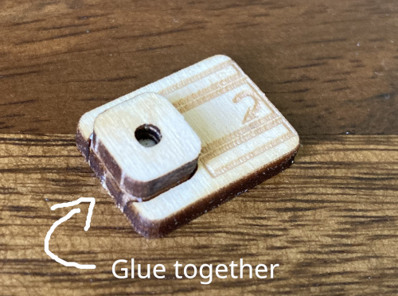

It needs to dry in the meantime.

## Step 2 - add copper tape to the bottom piece
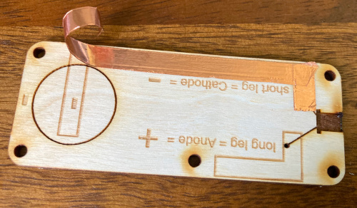

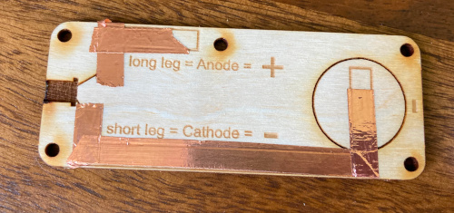

## Step 3 - add the LED
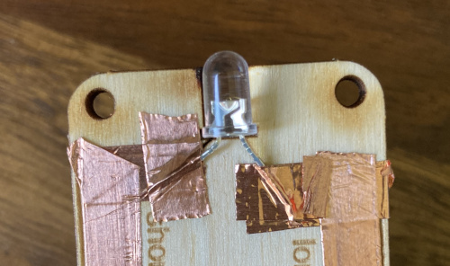

There are little holes for the legs of the LED.
- Punch trough the holes from the back side.
- Insert the legs and bend the LED in position. Pay close attention to the orientation of the LED (+ and -). See notes on the bottom piece.
- Glue an additional layer of copper tape over the legs of the LED

## Step 4 - add copper tape to the middle piece
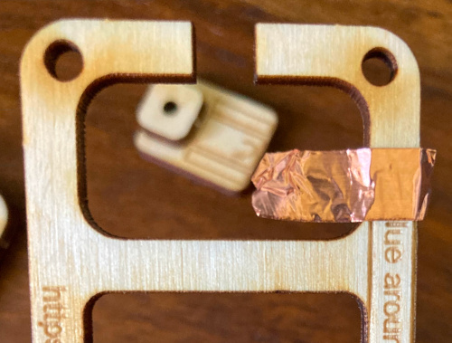

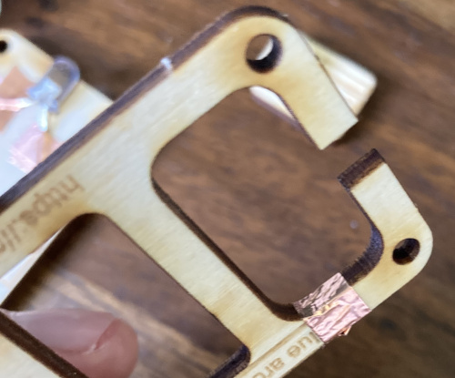

Don't wrap it around multiple times. It should be a single layer.

## Step 5 - add copper tape to the top piece
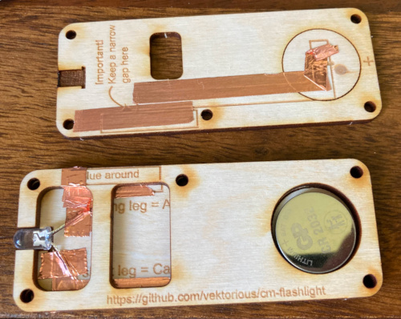

## Step 6 - add copper tape and screw to the slider
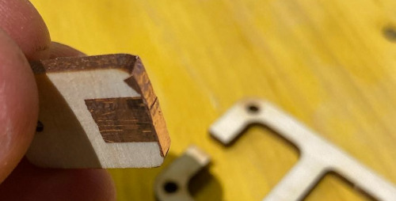

First put one strand of copper in the middle of the slider (marked). Add two additional strands on the sides.

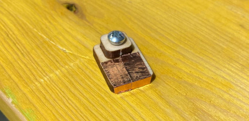

Screw the small wood screw into the the hole in the slider.

## Step 7 - check if it works!
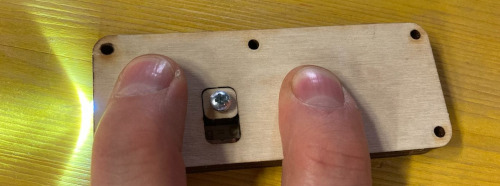

Add the battery (check the orientation!) and put everything together. The LED should light up if you press everything together slightly. if it does not work check the connections.

## Step 8 - add screws
Add the M3 screws and nuts but don't tighten them too much. Use the middle screw (near the slider) to adjust the tightness of the slider.

## Step 9 - done!
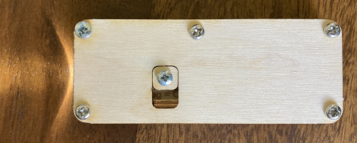
